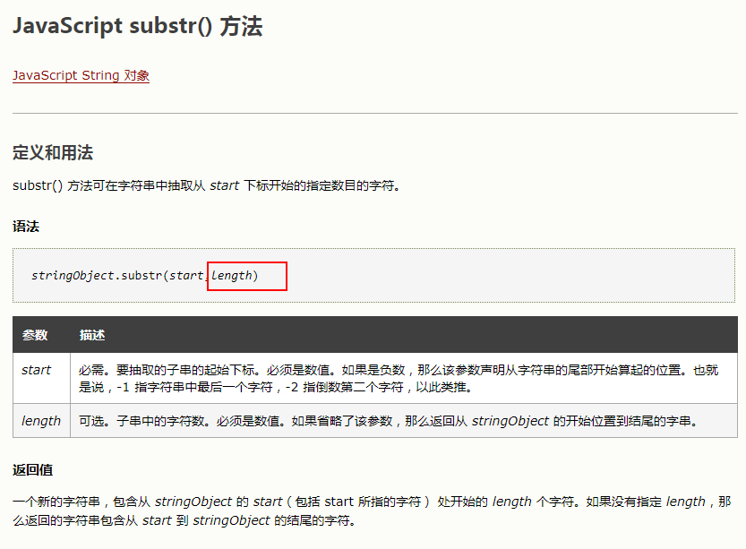
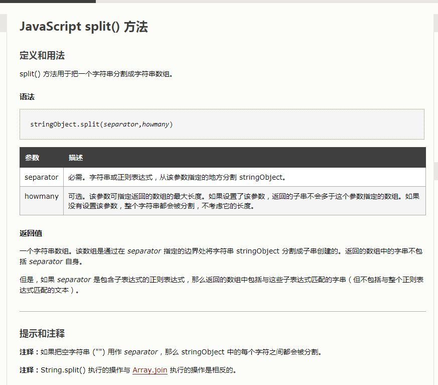
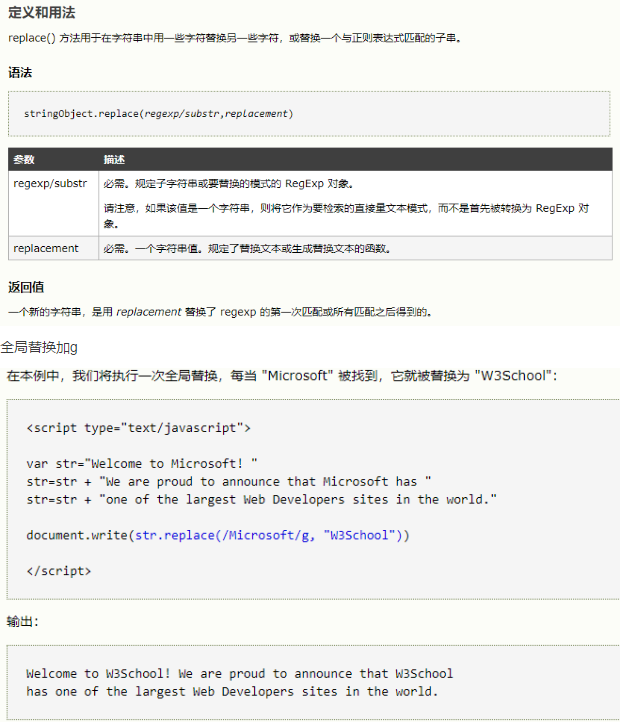
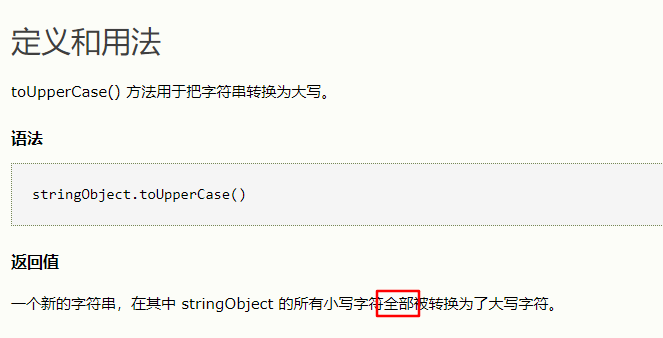
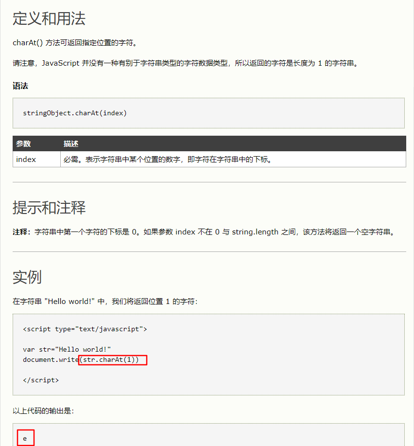
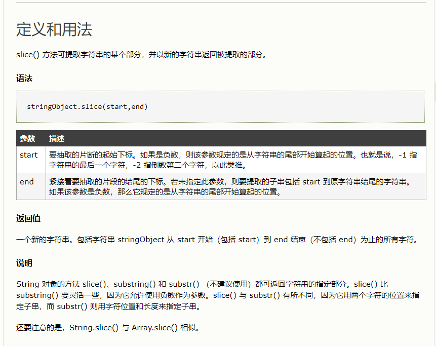
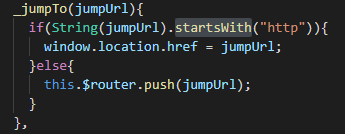

---

title: 字符串常用api

meta:
  - name: description
    content: 字符串常用api
  - name: keywords
    content: js api 字符串

created: 2021/09/17

updated: 2021/09/17

tags:
  - javascript
  - api
  - 字符串
  - Yur

---


<br/><br/><br/>

:tropical_drink: 描述:
> - `1` 字符串.substring()   
    获得字符串中的一部分字符串
> - `2` 字符串.substr()   
    获得字符串中的一部分字符串
> - `3` 字符串.split()   
    按一定条件把一个字符串分割成字符串数组
> - `4` 字符串.replace()   
    按一定条件替换字符串
> - `5` 字符串.toUpperCase()   
    把所有字符串转为大写
> - `6` 字符串.charAt()   
    返回指定位置的字符
> - `7` 字符串.slice()   
    提取字符串的某个部分
> - `8` 字符串.startsWith()   
    startsWith() 方法用于检测字符串是否以指定的前缀开始


<br/><br/><br/>

## 1.字符串.substring()  


<br/><br/><br/>

## 2.字符串.substr()  


<br/><br/><br/>

## 3.字符串.split() 


<br/><br/><br/>

## 4.字符串.replace() 

<br/><br/>
:sparkles: 例子1
``` js
  let str='thS'
  str.replace("S","/s")
```

<br/><br/><br/>

## 5.字符串.toUpperCase() 


<br/><br/><br/>

## 6.字符串.charAt() 


<br/><br/><br/>

## 7.字符串.slice() 

<br/><br/>
:sparkles: 例子1   
``` js
  arr.slice(0,5) 截取前5个
  <!-- '12312' -->
  '123123'.slice(0, -1)
```
<br/><br/><br/>

## 8.字符串.startsWith() 
:sparkles: 例子1   



<br/><br/><br/>


