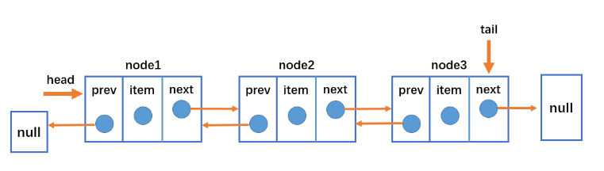
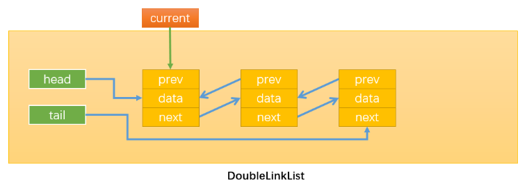

---

title: 数据结构-双向链表

meta:
  - name: description
    content: 双向链表
  - name: keywords
    content: 双向链表

created: 2021/10/20

updated: 2021/10/20

tags:
  - javascript
  - 双向链表
  - Yur

---

<br/><br/><br/>

## 双向链表

:tropical_drink: 概念    
    **双向链表：既可以从头遍历到尾，又可以从尾遍历到头。也就是说链表连接的过程是双向的，它的实现原理是：一个节点既有向前连接的引用，也有一个向后连接的引用。**

:sparkles: 优缺点    
    1.每次在插入或删除某个节点时，都需要处理四个引用，而不是两个，实现起来会困难些；   
    2.相对于单向链表，所占内存空间更大一些；但是，相对于双向链表的便利性而言，这些缺点微不足道。

:sparkles: 特点    
    1.双向链表不仅有head指针指向第一个节点，而且有tail指针指向最后一个节点；   
    2.每一个节点由三部分组成：item储存数据、prev指向前一个节点、next指向后一个节点；   
    3.双向链表的第一个节点的prev指向null；   
    4.双向链表的最后一个节点的next指向null；   

> 常见操作方法：
> 
> - `1` append（element）：向链表尾部添加一个新的项；
> - `2` inset（position，element）：向链表的特定位置插入一个新的项；
> - `3` get（element）：获取对应位置的元素；
> - `4` indexOf（element）：返回元素在链表中的索引，如果链表中没有元素就返回-1；
> - `5` update（position，element）：修改某个位置的元素；
> - `6` removeAt（position）：从链表的特定位置移除一项；
> - `7` isEmpty（）：如果链表中不包含任何元素，返回trun，如果链表长度大于0则返回false；
> - `8` size（）：返回链表包含的元素个数，与数组的length属性类似；
> - `9` toString（）：由于链表项使用了Node类，就需要重写继承自JavaScript对象默认的toString方法，让其只输出元素的值；
> - `10` forwardString（）：返回正向遍历节点字符串形式；
> - `11` backwordString（）：返回反向遍历的节点的字符串形式；

:sparkles:示意图1   
<br/>

 
:sparkles:示意图2   
<br/>


:sparkles: 双向链表封装
``` js
    //封装双向链表
    function DoubleLinklist(){
        //封装内部类：节点类
        function Node(data){
            this.data = data
            this.prev = null
            this.next = null
        }

        //属性
        this.head = null
        this.tail ==null
        this.length = 0

        //常见的操作：方法
        //一.append方法
        DoubleLinklist.prototype.append = data => {
            //1.根据data创建新节点
            let newNode = new Node(data)

            //2.添加节点
            //情况1：添加的是第一个节点
            if (this.length == 0) {
            this.tail = newNode
            this.head = newNode 
            //情况2：添加的不是第一个节点
            }else {
            newNode.prev = this.tail
            this.tail.next = newNode
            this.tail = newNode
            }

            //3.length+1
            this.length += 1
        }

        //二.将链表转变为字符串形式
        //2.1.toString方法
        DoubleLinklist.prototype.toString = () => {
            return this.backwardString()
        }

        //2.2.forwardString方法
        DoubleLinklist.prototype.forwardString = () => {
            //1.定义变量
            let current =this.tail
            let resultString = ""

            //2.依次向前遍历，获取每一个节点
            while (current) {
            resultString += current.data + "--"
            current = current.prev 
            }
            return resultString
        }

        //2.3.backwardString方法
        DoubleLinklist.prototype.backwardString = () => {
            //1.定义变量
            let current = this.head
            let resultString = ""

            //2.依次向后遍历，获取每一个节点
            while (current) {
            resultString += current.data + "--"
            current = current.next
            }
            return resultString
        }

        //三.insert方法
        DoubleLinklist.prototype.insert = (position, data) => {
            //1.越界判断
            if (position < 0 || position > this.length) return false

            //2.根据data创建新的节点
            let newNode = new Node(data)

            //3.插入新节点
            //原链表为空
            //情况1：插入的newNode是第一个节点
            if (this.length == 0) {
            this.head = newNode
            this.tail = newNode
            //原链表不为空
            }else {
            //情况2：position == 0
            if (position == 0) {
                this.head.prev = newNode
                newNode.next = this.head
                this.head = newNode
            //情况3：position == this.length 
            } else if(position == this.length){
                this.tail.next = newNode
                newNode.prev = this.tail
                this.tail = newNode
                //情况4：0 < position < this.length
            }else{
                let current = this.head
                let index = 0
                while(index++ < position){
                current = current.next
                }
                //修改pos位置前后节点变量的指向
                newNode.next = current
                newNode.prev = current.prev
                current.prev.next = newNode
                current.prev = newNode
            }
            }
            //4.length+1
            this.length += 1
            return true//返回true表示插入成功
        }

        //四.get方法
        DoubleLinklist.prototype.get = position => {
            //1.越界判断
            if (position < 0 || position >= this.length) {//获取元素时position不能等于length
            return null
            }

            //2.获取元素
            let current = null
            let index = 0
            //this.length / 2 > position:从头开始遍历
            if ((this.length / 2) > position) {
            current = this.head
            while(index++ < position){
            current = current.next
            }
            //this.length / 2 =< position:从尾开始遍历
            }else{
            current = this.tail
            index = this.length - 1
            while(index-- > position){
            current = current.prev
            }
            }
            return current.data
        }

        //五.indexOf方法
        DoubleLinklist.prototype.indexOf = data => {
            //1.定义变量
            let current = this.head
            let index = 0

            //2.遍历链表，查找与data相同的节点
            while(current){
            if (current.data == data) {
                return index
            }
            current = current.next
            index += 1
            }
            return -1
        } 

        //六.update方法
        DoubleLinklist.prototype.update = (position, newData) => {
            //1.越界判断
            if (position < 0 || position >= this.length) {
            return false
            }

            //2.寻找正确的节点
            let current = this.head
            let index = 0
            //this.length / 2 > position:从头开始遍历
            if (this.length / 2 > position) {
            while(index++ < position){
            current = current.next
            }
            //this.length / 2 =< position:从尾开始遍历
            }else{
            current = this.tail
            index = this.length - 1
            while (index -- > position) {
                current = current.prev
            }
            }

            //3.修改找到节点的data
            current.data = newData
            return true//表示成功修改
        }

        //七.removeAt方法
        DoubleLinklist.prototype.removeAt = position => {
            //1.越界判断
            if (position < 0 || position >= this.length) {
            return null
            }
            
            //2.删除节点
            //当链表中length == 1
            //情况1：链表只有一个节点
            let current = this.head//定义在最上面方便以下各种情况返回current.data
            if (this.length == 1) {
            this.head = null
            this.tail = null
            //当链表中length > 1
            } else{
            //情况2：删除第一个节点
            if (position == 0) {
                this.head.next.prev = null
                this.head = this.head.next
            //情况3：删除最后一个节点
            }else if(position == this.length - 1){
                current = this.tail//该情况下返回被删除的最后一个节点
                this.tail.prev.next = null
                this.tail = this.tail.prev
            }else{
            //情况4：删除链表中间的节点
                let index = 0
                while(index++ < position){
                current = current.next
                }
                current.next.prev = current.prev
                current.prev.next = current.next
            }
            }

            //3.length -= 1
            this.length -= 1
            return current.data//返回被删除节点的数据
        }
        /*--------------------其他方法-------------------*/
        //八.remove方法
        DoubleLinklist.prototype.remove = data => {
            //1.根据data获取下标值
            let index = this.indexOf(data)
            
            //2.根据index删除对应位置的节点
            return this.removeAt(index)
        }

        //九.isEmpty方法
        DoubleLinklist.prototype.isEmpty = () => {
            return this.length == 0
        }

        //十.size方法
        DoubleLinklist.prototype.size = () => {
            return this.length
        }

        //十一.getHead方法：获取链表的第一个元素
        DoubleLinklist.prototype.getHead = () => {
            return this.head.data
        }

        //十二.getTail方法：获取链表的最后一个元素
        DoubleLinklist.prototype.getTail = () => {
            return this.tail.data
        }

    }
```
