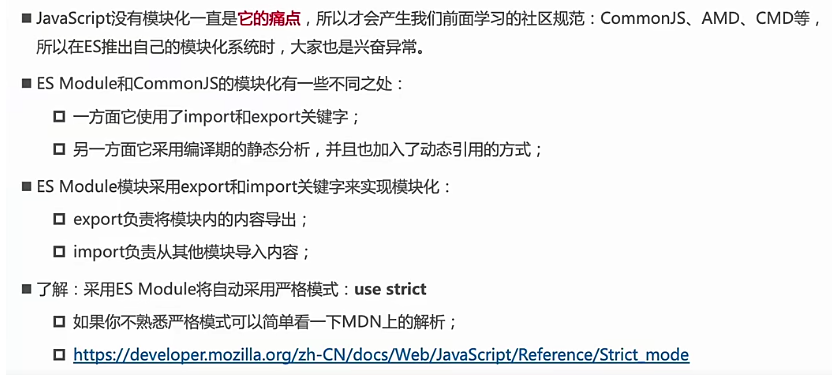
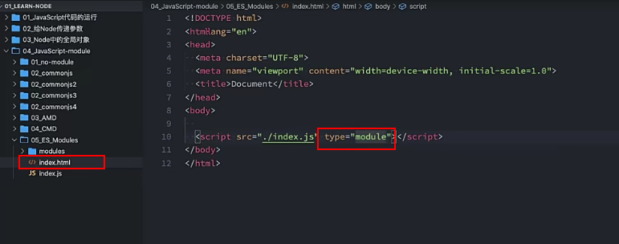
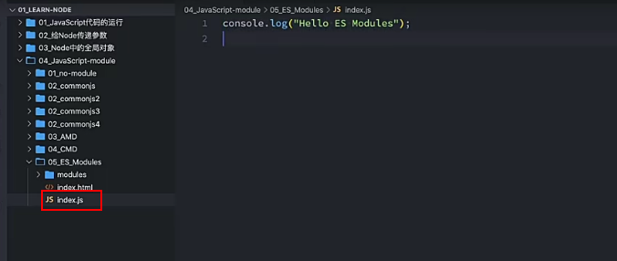
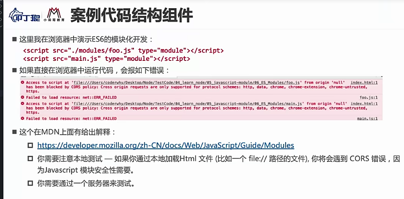

---

title: ES Module

meta:
  - name: description
    content: 认识 ES Module
  - name: keywords
    content: ES Module

created: 2021/09/14

updated: 2021/09/14

tags:
  - MarkDown
  - Yur

---

   

## ES Module介绍

:tropical_drink:ES Module是ECMAScript本身的模块化 在es6(javascript2015 2015年的时候出现) 

 

   

---

 

## ES Module使用示例
:sparkles: 例子1

- script标签引入JS文件时加上属性type="module"即可实现模块化js文件

- script标签引入JS文件时加上属性type="module"即可实现模块化js文件

::: error
如果右键浏览器运行 会报跨域错误,问题是不支持file协议本地打开
:::

::: success
解决办法 vscode安装live server插件启动一个服务 安装完后 右键open with live server 这样index.js就是一个模块了
:::
