---

title: fs模块详解

meta:
  - name: description
    content: fs模块详解
  - name: keywords
    content: fs

created: 2021/10/14

updated: 2021/10/14

tags:
  - fs
  - Yur

---

   

## FS模块介绍

:tropical_drink:FS模块是Node.js的文件系统

 

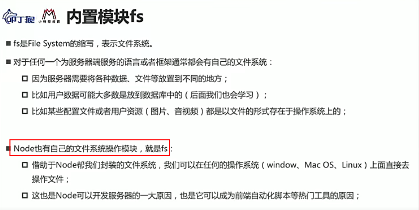

 

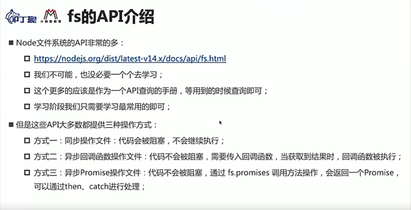
   

---

 

## FS模块操作文件使用示例
:sparkles: 例子1

- 获取文件信息的三种方式

 

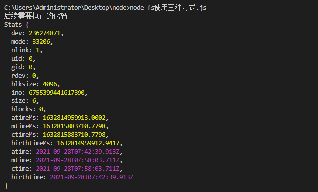

 

:sparkles: 例子2

- 通过使用文件描述符获取文件信息

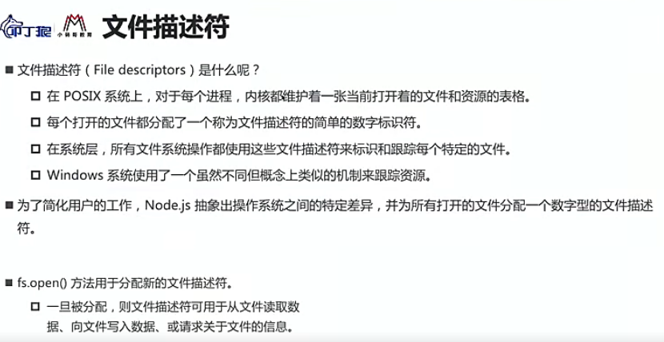

 

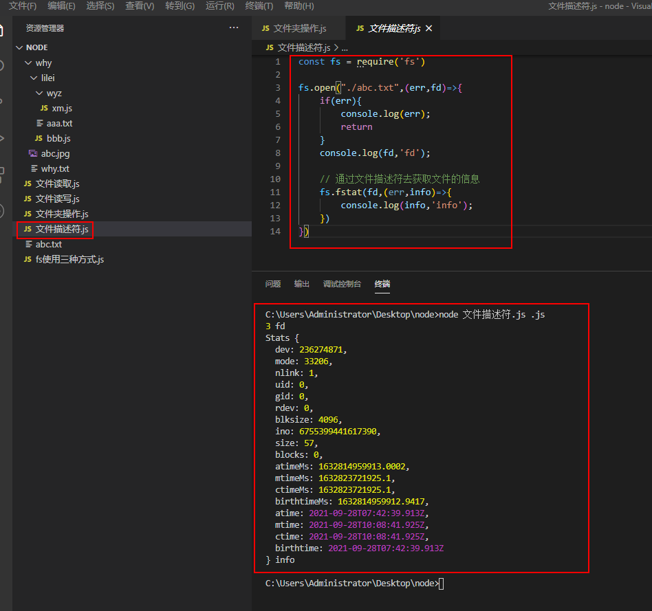

 

:sparkles: 例子3

- 文件写入

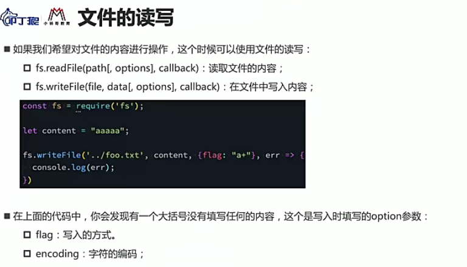

 

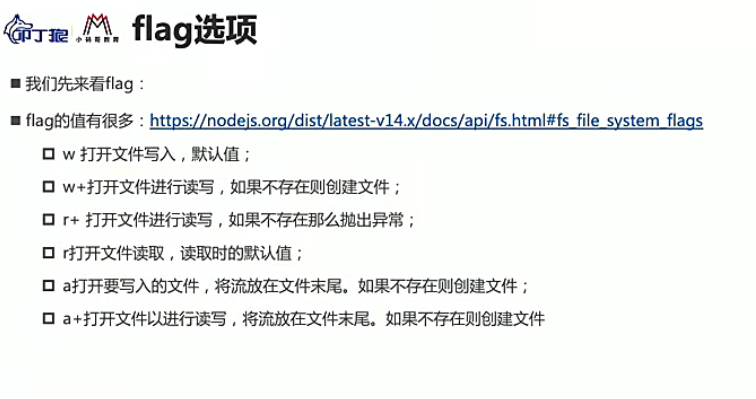

 
如果不指定编码:默认是 utf-8编码方式   

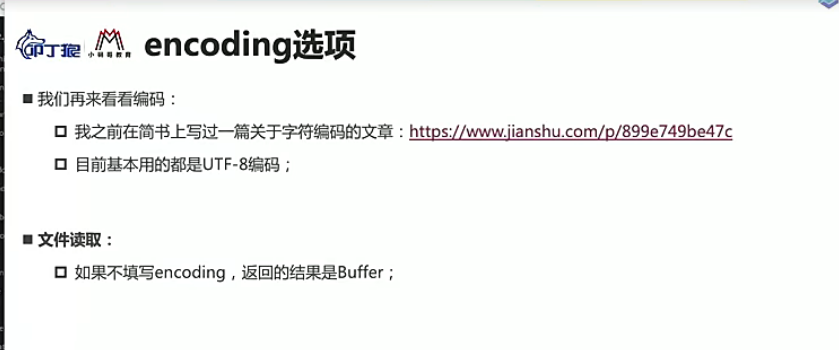

 

:sparkles: 例子4

- 文件写入

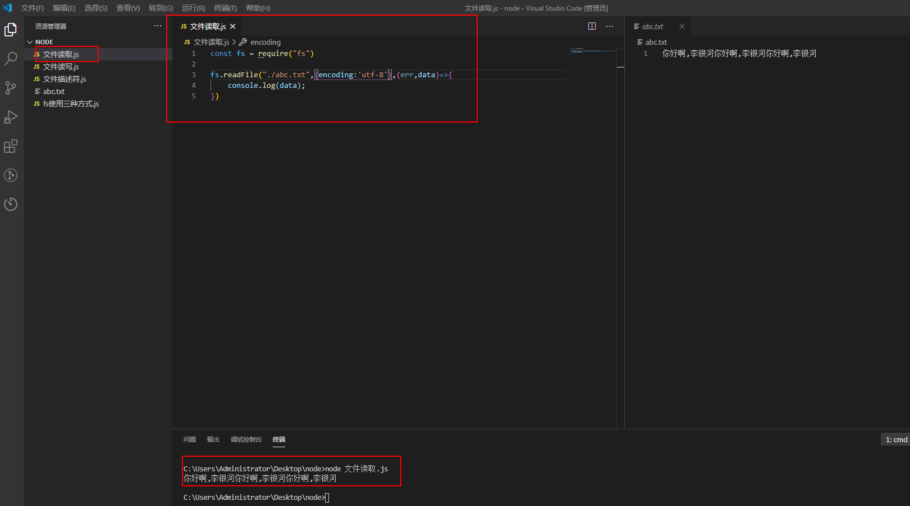

 

## FS模块操作文件夹使用示例
:sparkles: 例子1

- 1.创建文件夹  2.读取文件夹的所有文件  3.文件夹重命名 
  判断文件夹是否存在(fs.existSync) 
  创建文件夹(fs.mkdir) 
  读取文件夹(fs.readdir) 
  文件夹重命名(fs.rename) 

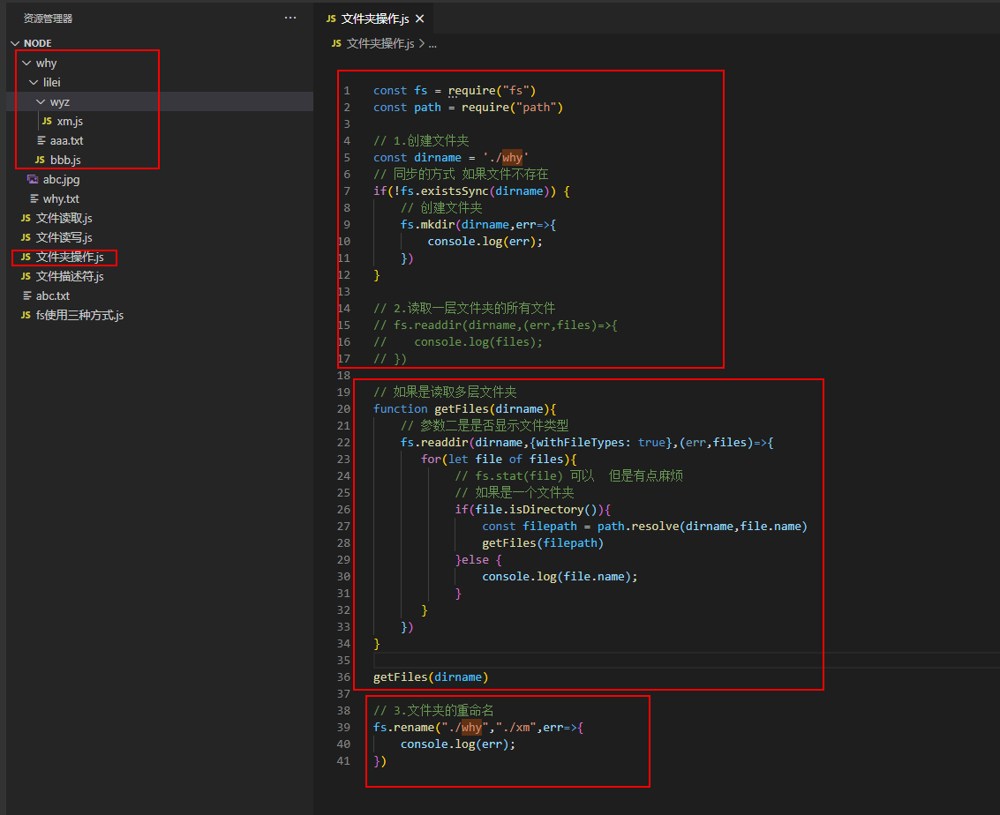

 

## 文件夹复制小练习
:sparkles: 例子1

- fs.readdirSync()可以同步拿到所有文件 
copyFileSync可以拷贝文件 

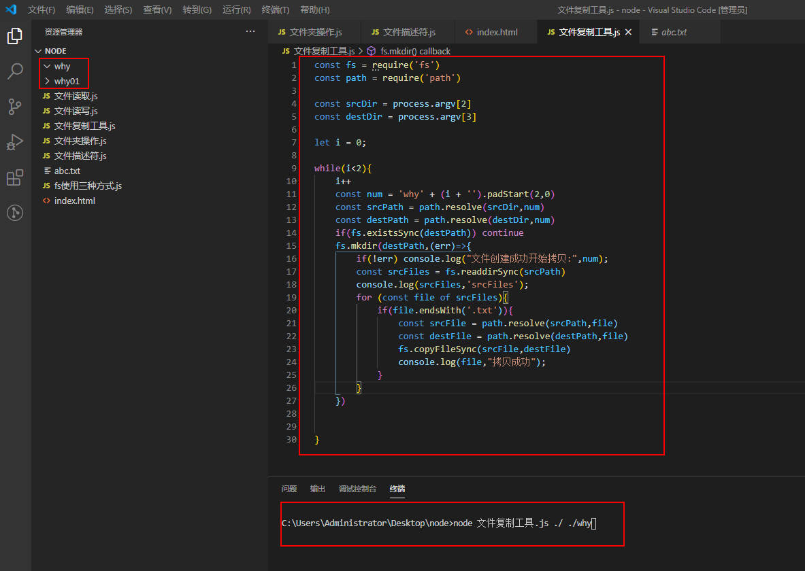

 