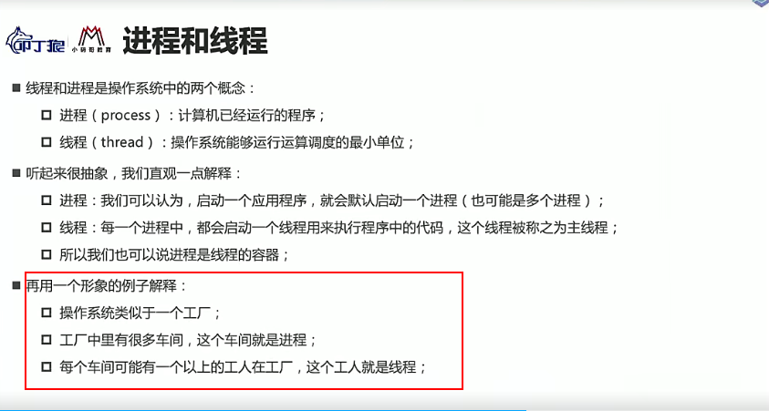
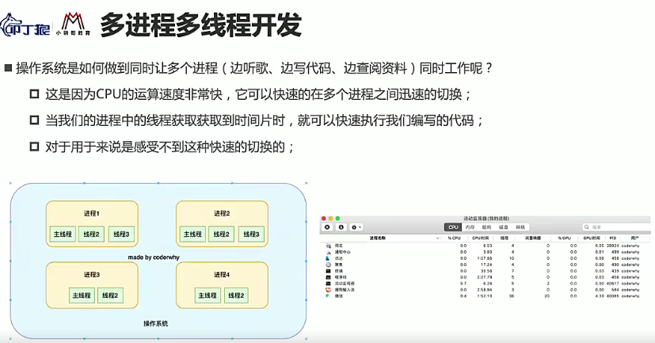
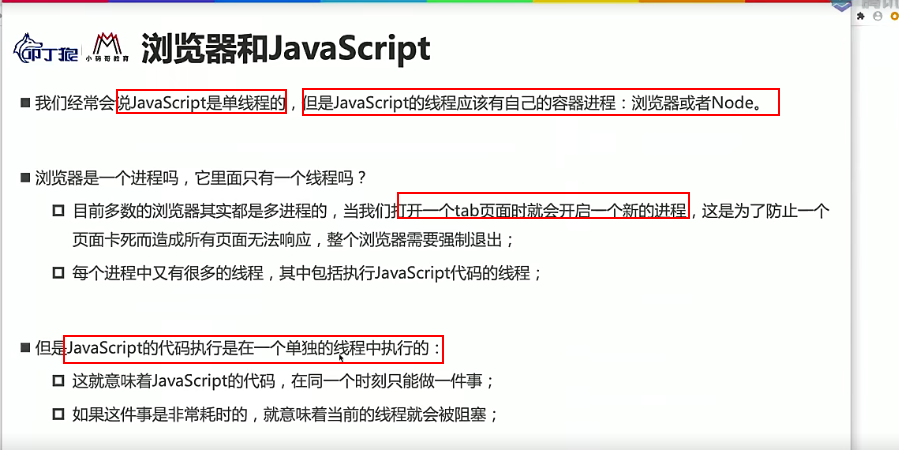
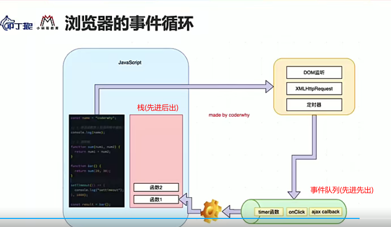

---

title: 进程线程以及js的执行过程

meta:
  - name: description
    content: 进程线程以及js的执行过程
  - name: keywords
    content: 进程 线程

created: 2021/11/18

updated: 2021/11/18

tags:
  - MarkDown
  - Yur

---

   

## 进程线程的概念

:tropical_drink:什么是进程?线程?

- 1.可以理解为启动一个应用程序便开启了一个或者多个进程
- 2.一个进程中可能同时运行一个或者多个线程,用于执行程序中的代码
 

   

---

 

## 多进程多线程的概念

:tropical_drink:多进程多线程的运行方式
 

   

---

 

## 浏览器中的js

:tropical_drink:浏览器中的js和js执行过程
- 1.js是单线程的,在浏览器(进程)或者node(进程)中运行
 

   

- 2.JS中默认线程执行是进栈的,先进后出.如果遇到异步如定时器,会进事件队列,在某个合适的实际再进栈

   

---

 

